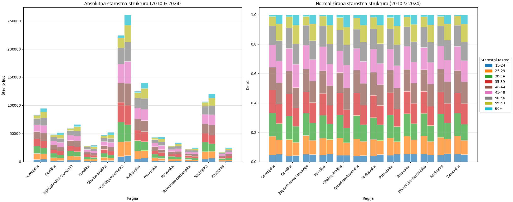

# Analiza delovno aktivnega prebivalstva in BDP Slovenije

*Končno poročilo projekta pri predmetu Podatkovno rudarjenje, skupina 9*

Cilj te analize je preučiti, kako se spreminja delovno aktivno prebivalstvo v Sloveniji in kakšna je njegova povezanost z bruto domačim proizvodom (BDP).

Člani:
- Nika Demšar
- Urška Frelih Uhelj
- Anja Klančar
- Eva Müller

## Podatki
Analiza temelji na dveh glavnih virih odprtih podatkov Slovenije iz podatki.gov.si:

Iz podatkov o zaposlenosti smo izločile leto 2025, ker so podatki nereprezentativni, saj se leto še ni končalo in bi pokvarilo povprečja. Podatke za ostala leta smo združile po letih, da smo vizualno predstavile spremembe v delavnem prebivalstvu skozi čas.

- Vir: [Delovno aktivno prebivalstvo](https://podatki.gov.si/dataset/surs0700992s)
Obdobje: 2010–2025
Atributi: Število delovno aktivnega prebivalstva, populacija, statistična regija, starostni razred in mesec
Namen: Spremljanje zaposlenosti in demografskih trendov. Podatki omogočajo analizo razdelitve po starostnih skupinah in regijah ter preučevanje sezonskih nihanj.
Izdatkovna struktura BDP

- Vir: [Izdatkovna struktura BDP](https://podatki.gov.si/dataset/surs0301935s?resource_id=8935a064-5888-4ab9-9066-0838f6f2743b)
Obdobje: 1995–2025
Atributi: Število delovno aktivnih prebivalcev, Površina (km2), Delež prebivalcev, Gostota naseljenosti, Živorojeni, Naravni prirast, Skupni selitveni prirast
Namen: Prikaz sprememb v sestavi BDP. Podatki omogočajo sledenje spremembam gospodarske aktivnosti in ugotavljanje vpliva na zaposlovanje.

- Vir: [Prebivalstvo po statističnih regijah](https://podatki.gov.si/dataset/surs2640005s)
Obdobje: 2008–2025
Atributi: Število delovno aktivnega prebivalstva, populacija, statistična regija, starostni razred...
Namen: Primerjava ostalih podatkov na celotni populaciji in analiza sestava prebivalstva

### Analiza delovno aktivnega prebivalstva
Prikazujemo vzorce v številu delovno aktivnih oseb v Sloveniji. Z različnimi grafi prikazujemo letne podatke o zaposlenosti v Sloveniji, podatke glede na regijo in starost.

### Analiza BDP in njegovih komponent
Prikazale smo tudi spreminjanje BDP skozi leta in to primerjale z številom delovnega prebivalstva. Pri tej primerjavi moramo upoštevati dvo letni zamik, saj se BDP določi za dve leti vnaprej.

## Rezultati
### Sestava prebivalstva in delež delovno aktivnih
Za razumevanje naslednjih podatkov je bilo najprej potrebno analizirati sestavo prebivalstva: koliko ljudi živi v Sloveniji, kolikšen je delež delovno sposobnih ter kolikšen je delež delovno aktivnih.
Opazimo, da se število prebivalcev ter število in delež delovno aktivnega prebivalstva povečujeta, medtem ko se delež delovno sposobnih prebivalcev zmanjšuje. To je posledica staranja prebivalstva.

### Starostne skupine
Ugotovile smo, da je vse več ljudi, starejših od 50 let, delovno aktivnih. Eden od glavnih razlogov za to, je staranje prebivalstva in daljšanje življenske dobe. To bi lahko bila tudi posledica slabih pokojnin, ki si jih višajo s podaljševanjem delovne dobe.
Opazile smo, da se je povprečna starost aktivnega prebivalstva zvišala za 2,8 leta. Najstarejša je obalna regija, kar lahko povezujemo tudi s priseljevanjem starejših prebivalcev, ki so blizu upokojitve.

### Regije
V številu delovnega prebivalstva najbolj izstopa Osrednjeslovenska regija, kar lahko povežemo s priseljevanjem v Ljubljano zaradi boljših pogojev in višjih plač. Največjo rast delovno aktivnega prebivalstva beležijo Osrednjeslovenska, Podravska in Savinjska regija, ki imajo tudi največja urbana središča. Koroška, Primorsko-notranjska in Posavska, kjer je rast delovno aktivnega prebivalstva počasnejša, predstavljajo manj urbanizirana območja Slovenije, kjer je veliko izseljevanja.

### BDP
Korelacija med delovno aktivnim prebivalstvom in bruto domačim proizvodom (BDP), ki znaša 0.951, kaže na zelo močno pozitivno povezanost med tema dvema spremenljivkama. To pomeni, da se BDP praviloma povečuje, kadar se povečuje tudi število delovno aktivnih prebivalcev – in obratno. To potrjuje, da je BDP eden izmed ključnih dejavnikov gospodarske rasti.

### BDP glede na delovno aktivno prebivalstvo in potrošnjo države
Končna potrošnja države je osrednji del javnofinančnih izdatkov (socialna varnost, javno zdravstvo, izobraževanje itd.), spreminjanje le-teh pa kaže na to, kako politika usmerja del DDP-ja nazaj v družbo.
Med podatki so lepo opazne gospodarske krize in epidemija COVID pri številu delovno aktivnega prebivalstva. To je močno padlo med 2010 in 2013, in nato še enkrat (manj) okoli leta 2020 - COVID-19. Kljub manjšemu padcu v letu 2020 lahko opazimo konstantno rast od leta 2014 dalje.
Pri BDP lahko vidimo zelo majhen padec med letoma 2010 in 2013, kar prav tako odraža učinke krize. Od tega leta dalje se začne rast (s ponovnim padcem zaradi epidemije).
Kaže se, da smo kljub učinkom kriz in epidemij lepo okrevali in se po vsakem padcu vrnili na rast. Ob pogledu na celotno obdobje (2010 - 2023) se lahko strinjamo, da ga zaznamuje rast vseh treh serij, kar podpira dejstvo, da je kombinacija gospodarske rasti in javnih izdatkov v pomoč rasti trga dela.
Iz podatkov lahko zaključimo, da moramo, če želimo spdobujati trg dela, javnofinančne ukrepe načrtovati vnaprej in pričakovati zamik njihovega polnega učinka.

## Zaključki
- Trend zaposlenosti kaže postopno rast do določenega leta, z možnim padcem ob gospodarskih krizah.
- Starejše starostne skupine v delovnem prebivalstvu se večajo
- Naraščanje delovno aktivnega prebivalstva v urbanih območjih je bolj izraženo kot drugje
- Trendi zaposlenosti naraščajo zelo podobno kot BDP
