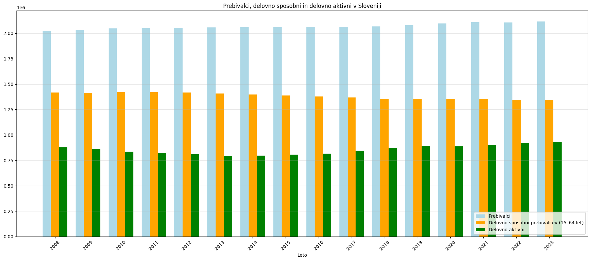
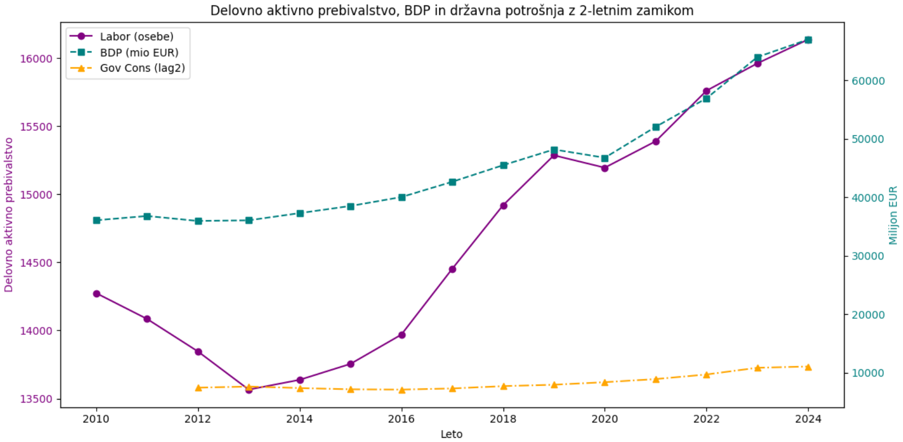
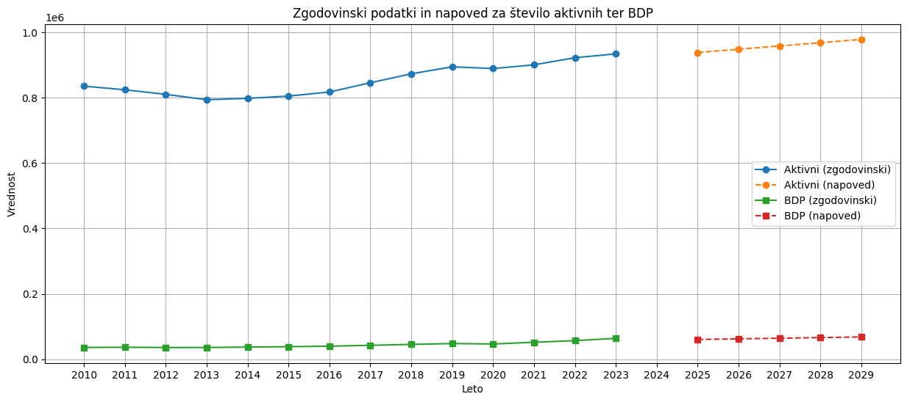

# Analiza delovno aktivnega prebivalstva in BDP Slovenije

*Končno poročilo projekta pri predmetu Podatkovno rudarjenje, skupina 9*

Cilj te analize je preučiti, kako se spreminja delovno aktivno prebivalstvo v Sloveniji in kakšna je njegova povezanost z bruto domačim proizvodom (BDP).

Člani:
- Nika Demšar
- Urška Frelih Uhelj
- Anja Klančar
- Eva Müller

## Uvod in opis problema

Projekt se osredotoča na analizo delovno aktivnega prebivalstva in strukture BDP v Sloveniji, pri čemer želimo razumeti, kako demografski trendi in gospodarski kazalniki vplivajo na število delovno aktivnih prebivalcev v Sloveniji. V poročilu so prikazani rezultati analize delovno aktivnega prebivalstva in strukture BDP v Sloveniji. Analiza temelji na odprtih podatkih, ki vključujejo število delovno aktivnega prebivalstva skozi čas in letne podatke o izdatkovni strukturi BDP. S tem pristopom smo želele odkriti časovne/regijske vzorce, vpliv kriznih obdobij (kot so gospodarska kriza in pandemija COVID-19) ter izdelati napovedne modele za prihodnje spremembe.

## Podatki
Analiza temelji na odprtih podatkih (podatki.gov.si), pridobljenih iz več virov.

Ker so leto 2025 in 2025 še nepopolni ( podatki še niso dokončni), smo v korakih predpriprave izločili najnovejše leto iz vsake serije, da ne bi popačili izračunov (npr. povprečij ali trendov). Podatke za ostala leta smo združile po letih, da smo vizualno predstavile spremembe v delavnem prebivalstvu skozi čas.

- Vir: [Delovno aktivno prebivalstvo](https://podatki.gov.si/dataset/surs0700992s)
Obdobje: 2010–2025
Atributi: Število delovno aktivnega prebivalstva, populacija, statistična regija, starostni razred in mesec
Namen: Spremljanje zaposlenosti in demografskih trendov. Podatki omogočajo analizo razdelitve po starostnih skupinah in regijah ter preučevanje sezonskih nihanj.
Izdatkovna struktura BDP

- Vir: [Izdatkovna struktura BDP](https://podatki.gov.si/dataset/surs0301935s?resource_id=8935a064-5888-4ab9-9066-0838f6f2743b)
Obdobje: 1995–2025
Atributi: Število delovno aktivnih prebivalcev, Površina (km2), Delež prebivalcev, Gostota naseljenosti, Živorojeni, Naravni prirast, Skupni selitveni prirast
Namen: Prikaz sprememb v sestavi BDP. Podatki omogočajo sledenje spremembam gospodarske aktivnosti in ugotavljanje vpliva na zaposlovanje.

- Vir: [Prebivalstvo po statističnih regijah](https://podatki.gov.si/dataset/surs2640005s)
Obdobje: 2008–2025
Atributi: Število delovno aktivnega prebivalstva, populacija, statistična regija, starostni razred...
Namen: Primerjava ostalih podatkov na celotni populaciji in analiza sestava prebivalstva

### Analiza delovno aktivnega prebivalstva
Najprej smo za celotno državo pripravile letno analizo števila delovno aktivnih oseb. Dobljena časovna vrsta (št. delovno aktivnih prebivalcev za eno leto) 
je bila sortirana po letih. Da bi razumele, kako velika je dejanska zaposlenost znotraj celotne populacije, smo vsako starostno skupino razdelile še na delovno sposobne/nesposobne in 
delovno aktivne prebivalce. S to ločitvijo smo lahko s pomočjo izračuna deleža delovno aktivnih med delovno sposobnimi dobile veliko bolj realen in primerljiv rezultat.

Izvedle smo tudi analizo starostnih skupin delovno aktivnega prebivalstva, kjer smo podatke združile po letih in starostnih razredih in analiza strukture delovno aktivnega prebivalstva po regijah.

### Analiza BDP in njegovih komponent
Za vsako leto (od 2010 do 2023) smo izluščile BDP in končno potrošnjo države. Seriji podatkov sta bili sortirani po letu in pretvorjeni v numerične vrednosti.
Končna potrošnja je zamaknjena za dve leti, da smo dobile višjo korelacijo z zamaknjenim vplivom na trg dela.

### Napoved števila aktivnih prebivalcev in BDP

Za izdelavo kratkoročne napovedi smo uporabile linearni regresijski model, pri čemer smo za obe neodvisni spremenljivki (LABOR in BDP)
modelirale v odvisnosti od leta.

## Rezultati

### Struktura delovno aktivnega prebivalstva v Sloveniji
Rezulati osnovne analize strukture prebivalstva Slovenije so pokazali, da se v zadnjih letih vztrajno povečuje
število delovno aktivnih na splošno. Število delovno sposobnega prebivalstva skozi leta ostaja zelo konstantno (manjše variacije), med tem ko se število delovno aktivnega prebivalstva povečuje. 
To nam pove, da je delež zaposlenih med delovno sposobimi vedno večji.

#### Starostne skupine

Povprečna starost se je med letoma 2010 in 2023 dvignila za 2,8 leta., kar je posledica kombinacije
demografskega staranja (manj je mladih, več starejših) in podaljševanja delovne dobe (zaradi finančnih pritiskov in sprememb upokojitvene zakonodaje).
Med regijami je najstarejša obalna, kar lahko povezujemo tudi s tamkajšnjim priseljevanjem starejših, ki so tik pred upokojitvijo.
Med vsemi starostnimi skupinami izstopajo prebivalci med 30 in 40-im letom starosti, kjer skupno število v zadnjih letih pada.

#### Regijska sestava

Na prvi pogled izstopa Osrednjeslovenska regija, ki je od leta 2010 do 2023 povečala število delovno aktivnih prebivalcev s približno 200.000 na skoraj 260.000, 
kar je povezano z visoko urbanizacijo, koncentracijo državnih in zasebnih organizacij ter zadostno ponudbo delovnih mest. Druga regija z visoko rastjo je Podravska, kjer je 
 industrijska ponudba pritegnila več delovne sile, tretja pa Savinjska, ki jo zaznamuje močno razvito industrijsko središče. Po drugi strani so manj urbanizirane regije, 
kot so Koroška, Primorsko-notranjska in Posavska, beležile manjšo rast ali celo nespremenjeno stanje, kar kaže na izseljevanje predvsem mlajših generacij v iskanju boljših zaposlitvenih možnosti.

### BDP in povezava s številom delovno aktivnih

#### BDP
Korelacija med delovno aktivnim prebivalstvom in bruto domačim proizvodom (BDP), ki znaša 0.951, kaže na zelo močno pozitivno povezanost med tema dvema spremenljivkama. 
To pomeni, da se BDP praviloma povečuje, kadar se povečuje tudi število delovno aktivnih prebivalcev – in obratno. 
Med letoma 2011 in 2013 se je gospodarska rast zaradi svetovne finančne krize nekoliko umirila oziroma rahlo upadla. Po letu 2013, ko je gospodarstvo
ponovno začelo pridobivati na moči, je bila rast (kljub krajšemu padcu zaradi pandemije COVID-19) konstanta

#### Končna potrošnja države z zamikom

Da bi preverile, kako se spremembe državne potrošnje odražajo na trgu dela, smo ustvarile serijo GOV_CONS_LAG2 (potrošnja z 2-letnim zamikom). Uporaba dvoletnega zamika
je ekonomsko utemeljena, ker se državni proračun načrtuje probližno za dve leti vnaprej in se sredstva pogosto začnejo dejansko porabljati 
šele v naslednjih dveh letih. 

Iz podatkov lahko zaključimo, da moramo, če želimo spdobujati trg dela, javnofinančne ukrepe načrtovati vnaprej in pričakovati zamik njihovega polnega učinka.

### Napoved števila delovno aktivnih in BDP do leta 2029

#### Linearni regresijski model

Model linearne regresije za število delovno aktivnih prebivalcev je na podlagi 
podatkov iz let 2010-2023 pokazal, da se vsako leto število poveča. Prav tako se poveča tudi BDP - napovedi temeljijo na predpostavki, da bi trend rasti ostal linerarno konstanten.

#### Omejitve in interpretacija
Ker linearna regresija ne zajame nenadnih makroekonomskih šokov, kot so globalna finančna kriza, energetska kriza ali ponovna pandemija, predstavlja ta napoved le okvirni scenarij, ki lahko
služi kot osnovni indikator za strateško načrtovanje, ni pa ga dobro jemati kot trdno zapisanega (v praksi bo zelo verjetno prišldo do odstopanj - zlasti v primeru pojavitve zgoraj naštetih razlogov).
Prav tako model ne vključuje dodatnih spremenljivk, kot so cenovni indeksi energentov, demografske projekcije rodnosti in migracij, ki lahko pomembno vplivajo na napovedane vrednosti v prihodnje.

## Glavne ugotovitve

Analiza obdobja 2010-2023 je potrdila, da se je slovenski trg skozi leta uspešno prilagajal demografskim spremembam. Čeprav je delež starih od 15 do 64 let upadel, se je delež dejansko 
zaposlenih med tistimi, ki so sposobni delati znatno povečal. Ena izmed glavnih ugootovitev je, da se je povprečna starost aktivne delovne sile dvignila, saj ostajajo starejpi delavci dlje na trgu dela.
Močna pozitivna korelacija med številom zaposlenih in BDP, ter še višja korelacija sk  končno potrošnjo poudarjata, da je gospodarska rast tesno povezana z zaposlovanjem in da se javnofinančni ukrepi na trgu dela
pokažejo z dvoletnim zamikom.

Linearna napoved je nakazala nadaljno zmerno rast obeh spremenljivk do leta 2029, vendar  je treba upoštevati, da je uporabljen napovedni model preprost
in ne zajema morebitnih nenadnih gospodarskih šokov. 
